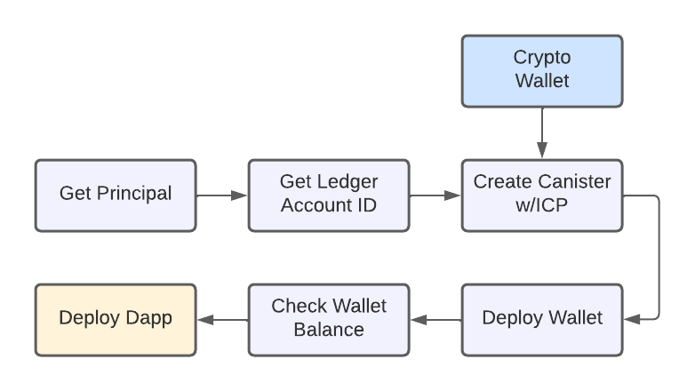

author: DFINITY
summary: Deploy a Dapp to the Internet Computer
id: deploy_to_ic
categories: codelab,markdown
environments: Web
status: Published
feedback link: https://github.com/dfinity/docs

# Deploy to IC

## Introduction
Duration: 0:02:00

This CodeLab shows how to deploy a dapp on the Internet Computer. Deploying to the mainnet is very similar to deploying a dapp locally. The main difference is that a wallet canister has to be setup with cycles, before dapp canisters can be deployed on the IC, where locally the wallet canister is automatically generated with test cycles. 

This CodeLab covers:

- Get principle ID
- Get ledger account ID
- Add ICP to ledger
- Create canister with an initial amount of ICP
- Deploy wallet with cycles
- Deploy dapp to the IC 

The flow looks like this:



## Get principle ID
Duration: 0:01:00

Assuming `dfx` is already installed (otherwise follow the instructions [here](https://smartcontracts.org/docs/developers-guide/install-upgrade-remove.html), run this command to get the principle ID:

```bash
$ dfx identity get-principal
j5zim-3qiww-r4e6e-upqsu-mvjps-aaaaa-sssss-ddddd-fffff-ggggg-lqe
```

## Get ledger account ID
Duration: 0:01:00

Run this command to get the ledger account ID:

```bash
$ dfx ledger account-id
a701e599a611fda1513601520d8f7e117a3f7b9b2933a10131ddb29asd123fgh
```

## Send ICP to ledger
Duration: 0:02:00

The ledger can receive ICP by sending ICP to the ledger account ID from an exchange holding ICP. In the example here Coinbase is used, but any exchange supporting ICP can be used. 


Run this command to get the ledger account ID:

```bash
$ dfx ledger account-id
a701e599a611fda1513601520d8f7e117a3f7b9b2933a10131ddb29asd123fgh
```

**Note:** Free cycles are available from the Cycles Faucet [here](https://smartcontracts.org/docs/quickstart/cycles-faucet.html). 


