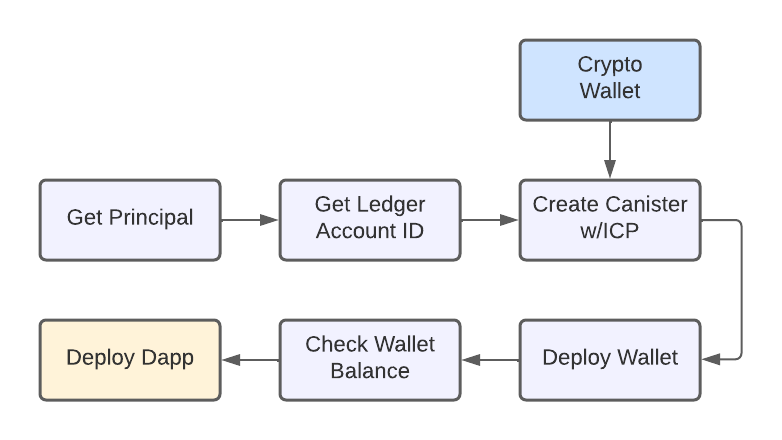
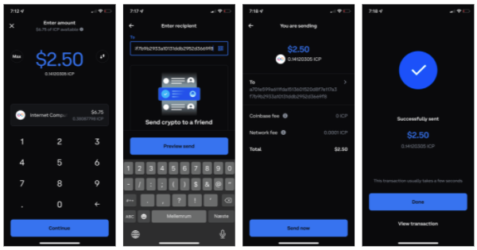

# Deploy to IC

## Introduction
This CodeLab shows how to deploy a dapp on the Internet Computer. Deploying to the mainnet is very similar to deploying a dapp locally. The main difference is that a wallet canister has to be setup with cycles, before dapp canisters can be deployed on the IC, where locally the wallet canister is automatically generated with test cycles. 

This CodeLab covers:

- Get principle ID
- Get ledger account ID
- Add ICP to ledger
- Create canister with an initial amount of ICP
- Deploy wallet with cycles
- Deploy dapp to the IC 

The flow looks like this:



## Get principle ID
Assuming `dfx` is already installed (otherwise follow the instructions [here](https://smartcontracts.org/docs/developers-guide/install-upgrade-remove.html), run this command to get the principle ID:

```bash
$ dfx identity get-principal
j5zim-3qiww-r4e6e-upqsu-mvjps-aaaaa-sssss-ddddd-fffff-ggggg-lqe
```

## Get ledger account ID
Run this command to get the ledger account ID:

```bash
$ dfx ledger account-id
a701e599a611fda1513601520d8f7e117a3f7b9b2933a10131ddb29asd123fgh
```

## Send ICP to ledger
The ledger can receive ICP by sending ICP to the ledger account ID from an exchange holding ICP. In the example here Coinbase is used, but any exchange supporting ICP can be used. 



After sending ICP to the ledger, the balance can be retrieved:

```bash
$ dfx ledger --network ic balance
0.14120305 ICP
```

**Note:** Free cycles are available from the Cycles Faucet [here](https://smartcontracts.org/docs/quickstart/cycles-faucet.html). 

## Create canister with ICP
Next create a canister pre-loaded with ICP. This canister will be used as the wallet canister holding cycles. The principle ID retrieved in the second step is used in this step to link the canister to the principle.

```bash
$ dfx ledger --network ic create-canister j5zim-3qiww-r4e6e-upqsu-mvjps-aaaaa-sssss-ddddd-fffff-ggggg-lqe --amount 0.125      
Transfer sent at BlockHeight: 2617478
Canister created with id: "ncmzx-piaaa-aaaaa-bbbbb-cai"
```

## Deploy the wallet canister
The canister created in the previous step will now be converted to a wallet canister, and the ICP will be converted to cycles.

```bash
$ dfx identity --network ic deploy-wallet ncmzx-piaaa-aaaaa-bbbbb-cai
Creating a wallet canister on the ic network.
The wallet canister on the "ic" network for user "admin" is "ncmzx-piaaa-aaaaa-bbbbb-cai"
```

Verify the wallet canister is setup correctly by checking the balance:

```bash
$ dfx wallet --network ic balance
5067478614885 cycles.
```

### Add cycles
Cycles can be added to a wallet canister by running this command, in this example 0.1 ICP is added: 

```bash
$ dfx ledger --network ic top-up ncmzx-piaaa-aaaaa-bbbbb-cai --amount 0.1
Transfer sent at BlockHeight: 81520
Canister was topped up!
```

The ledger will need to have sufficient ICP to top up the wallet canister with the chosen amount. If the ledger doesn't have sufficient ICP, then repeat Step 4.

## Deploy dapp
A dapp can now be deployed to the IC and be public available, by running this command in the dapp project root:

```bash
$ dfx deploy --network ic 
```

It's the same command used for local deploys, but with the added parameter `--network ic`.


