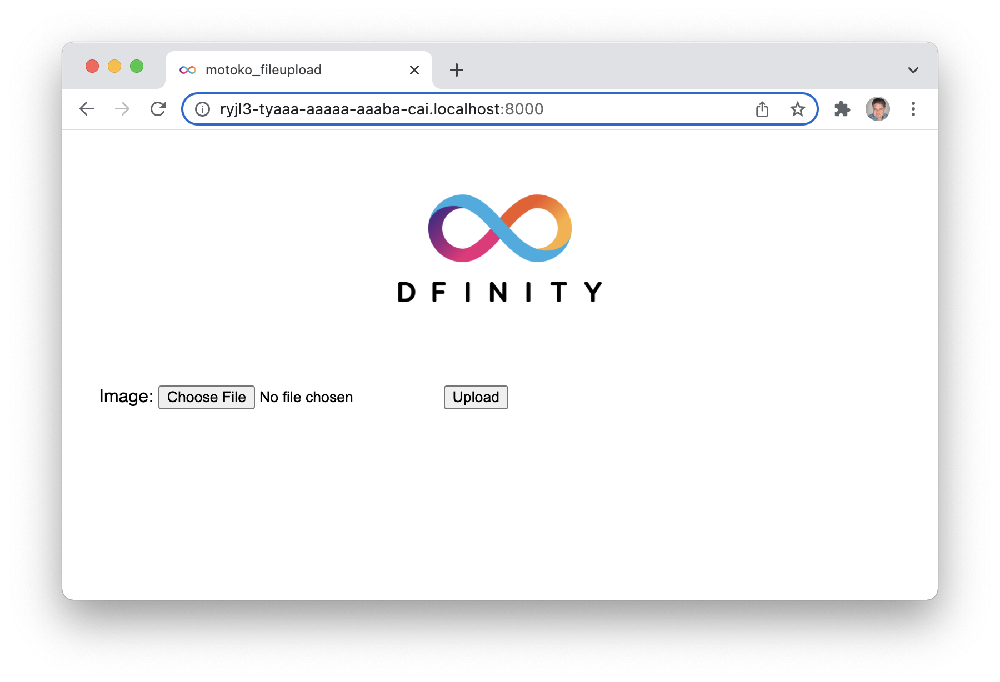

# Fileupload in Motoko 
The example dapp shows how to build a very basic dapp, which can upload image files from a frontend to an asset canister. The dapp is using Motoko for the backend functionality and plain HTML and JavaScript for the frontend. 



## Introduction
The purpose of this example dapp is to build a dapp, based on the default dapp template, installed by `dfx` when creating a new project. The dapp is a simple website with file upload controls. An image file can be selected from the local computer, and uploaded to an asset canister. When the upload is complete, the image is shown on the page.

This example covers:

- Create new canister smart contract using the SDK (`dfx`)
- Use the default project as a template as the starting point for the new project
- Add backend functions for receiving chunked file uploads
- Implement backend functions in the frontend
- Deploy the canister smart contract locally
- Test backend with Candid UI and command line using DFX, and test frontend in browser

## Installation
This example project can be cloned, installed and deployed locally, for learning and testing purposes. The instructions are based on running the example on either macOS or Linux, but when using WSL2 on Windows, the instructions will be the same.

### Prerequisites
The example project requires the following installed:

- git
- Node.js
- dfx

Git and Node can be installed from various package managers. DFX can be installed following the instructions [here](https://smartcontracts.org/docs/quickstart/local-quickstart.html#download-and-install).

### Install
Install the example dapp project:

```bash
$ git clone https://github.com/dfinity/examples
$ cd motoko/motoko-fileupload
$ npm install
```

The project folder will then look like this:


## Documentation
The three main parts of the example dapp are the backend, the Candid interface and the frontend. This example project is based on the default project, which is created when running the `dfx new project_name` command, but most of the default project code is replaced to create the upload functionality in this project.

The fileupload is done in chunks, to support uploading larger files than 2MB, which is the ingress limit. Uploaded files are stored in an asset canister, which can serve assets like image files.

### Motoko backend
The backend functions are located in the `src/simple_fileupload/main.mo` Motoko file. The backend can receive a batch of chunks of a file, when a file is uploaded in the frontend, and when the batch is complete, it stores the file in the asset canister. The backend also includes functionality to serve the file to the frontend.

#### Create chunk
The function `create_chunk()` takes a chunk of a file, and adds the chunk, and an ID identifying the chunk, to the `chunks` HashMap. The chunk ID is incremented before adding the chunk to `chunks`.


```javascript
private var nextChunkID: Nat = 0;

private let chunks: HashMap.HashMap<Nat, Types.Chunk> = HashMap.HashMap<Nat, Types.Chunk>(
  0, Nat.equal, Hash.hash,
);

public shared({caller}) func create_chunk(chunk: Types.Chunk) : async {
  chunk_id : Nat
} {
  nextChunkID := nextChunkID + 1;
  chunks.put(nextChunkID, chunk);

  return {chunk_id = nextChunkID};
};
```

#### Commit batch
The function `commit_batch()` concatenates the file chunks, and adds the content to the `assets` HashMap, with encoding data. The `assets` HashMap is used as file storage in the asset canisters. The file's name is used as `batch_name`, and the file identifier, which makes it easy to use the filename when requesting the file from the frontend.  

```javascript
private let assets: HashMap.HashMap<Text, Types.Asset> = HashMap.HashMap<Text, Types.Asset>(
  0, Text.equal, Text.hash,
);

public shared({caller}) func commit_batch(
  {batch_name: Text; chunk_ids: [Nat]; content_type: Text;} : {
    batch_name: Text;
    content_type: Text;
    chunk_ids: [Nat];
  },
) : async () {
  var content_chunks : [[Nat8]] = [];

  for (chunk_id in chunk_ids.vals()) {
    let chunk: ?Types.Chunk = chunks.get(chunk_id);

    switch (chunk) {
      case (?{content}) {
        content_chunks := Array.append<[Nat8]>(content_chunks, [content]);
      };
      case null {
      };
    };
  };

  if (content_chunks.size() > 0) {
    var total_length = 0;
    for (chunk in content_chunks.vals()) total_length += chunk.size();

    assets.put(Text.concat("/assets/", batch_name), {
      content_type = content_type;
      encoding = {
        modified  = Time.now();
        content_chunks;
        certified = false;
        total_length
      };
    });
  };
};
```

The function returns the incremented counter variable.

#### HTTP Request()
Asset canisters can be receive HTTP requests and serve web pages and assets like image files. In this example dapp the frontend is showing the uploaded image on the page after the upload has completed. The backend needs to support the incoming requests to get an image, and a streaming strategy for sending the image data to the browser.

##### GET request
The `http_request` function handles HTTP queries. A GET method is implemented to handle requests to get uploaded images. The request URL is parsed to identify the filename, and the content associated with the filename, headers, status code and streaming strategy is returned as a response to the request.

```javascript
public shared query({caller}) func http_request(
  request : Types.HttpRequest,
) : async Types.HttpResponse {

  if (request.method == "GET") {
    let split: Iter.Iter<Text> = Text.split(request.url, #char '?');
    let key: Text = Iter.toArray(split)[0];
    let asset: ?Types.Asset = assets.get(key);

      switch (asset) {
        case (?{content_type: Text; encoding: Types.AssetEncoding;}) {
          return {
            body = encoding.content_chunks[0];
            headers = [ ("Content-Type", content_type),
                        ("accept-ranges", "bytes"),
                        ("cache-control", "private, max-age=0") ];
            status_code = 200;
            streaming_strategy = create_strategy(
              key, 0, {content_type; encoding;}, encoding,
            );
          };
        };
        case null {
      };
    };
  };

  return {
    body = Blob.toArray(Text.encodeUtf8("Permission denied. Could not perform this operation"));
    headers = [];
    status_code = 403;
    streaming_strategy = null;
  };
};
```

#### Streaming strategy
Using a streaming strategy will return the data requested in chunks, which allows for returning larger files. The streaming strategy includes a function to create a token, a function to create the strategy and a callback function.

_Create token_
The function `create_token()` checks if there are remaining file chunks and returns a new token if there is. If there are not any remaining chunks, then `null` is returned.
```javascript
private func create_token(
  key : Text,
  chunk_index : Nat,
  asset : Types.Asset,
  encoding : Types.AssetEncoding,
) : ?Types.StreamingCallbackToken {

  if (chunk_index + 1 >= encoding.content_chunks.size()) {
    null;
  } else {
    ?{
      key;
      index = chunk_index + 1;
      content_encoding = "gzip";
    };
  };
};
```

_Create strategy_<br>
The function `create_strategy()` uses `create_token()` to check of there are file chunks left to process. If there is, a callback function is setup for the asset canister to handle file chunks. 
```javascript
private func create_strategy(
  key : Text,
  index : Nat,
  asset : Types.Asset,
  encoding : Types.AssetEncoding,
) : ?Types.StreamingStrategy {
  switch (create_token(key, index, asset, encoding)) {
    case (null) { null };
    case (? token) {
      let self: Principal = Principal.fromActor(Assets);
      let canisterId: Text = Principal.toText(self);
      let canister = actor (canisterId) : actor { http_request_streaming_callback : shared () -> async () };

      return ?#Callback({
        token; 
        callback = canister.http_request_streaming_callback;
      });
    };
  };
};
```


_Create token_

```javascript
private func create_token(
  key : Text,
  chunk_index : Nat,
  asset : Types.Asset,
  encoding : Types.AssetEncoding,
) : ?Types.StreamingCallbackToken {

  if (chunk_index + 1 >= encoding.content_chunks.size()) {
    null;
  } else {
    ?{
      key;
      index = chunk_index + 1;
      content_encoding = "gzip";
    };
  };
};
```

### Candid interface
The Candid interface is automatically created, and it has a convenient UI, which provides an easy, user-friendly way to test the backend. Learn how to access the Candid UI in the **Testing** section below. 

### Frontend
The default project installed with `dfx new project_name` has an `index.html` file with page HTML and an `index.js` file with an implementation of the backend functions. These two files are modified in this example project to support the counter functionality, and the backend functions.

#### HTML
All HTML code is in the `src/minimal_dapp_assets/src/index.html` file, and most of the HTML is carried over from the default project. The button is kept and so is the section showing the result, just simplified.

```html
<!doctype html>
<html lang="en">
    <head>
        <meta charset="UTF-8">
        <meta name="viewport" content="width=device-width">
        <title>Minimal Dapp</title>
        <base href="/">

        <link type="text/css" rel="stylesheet" href="main.css" />
    </head>
    <body>
        
        <section>
            <button id="clickMeBtn">Click Me!</button>
        </section>
        <section id="counter"></section>
    </body>
</html>
```

#### Javascript
Two eventlisteners are added to the JavaScript file, `src/minimal_dapp_assets/src/index.js`, the existing JavaScript file from the default project. One eventlistener is for detecting button clicks, and it's calling the `count()` function in the backend, and an eventlistener for page load is added to get the initial value of the counter with `getCount()`. The backend functions are imported through the Candid interface.

```javascript
import { minimal_dapp } from "../../declarations/minimal_dapp";

document.addEventListener('DOMContentLoaded', async function () {
  const counter = await minimal_dapp.getCount();
  document.getElementById("counter").innerText = "Counter: " + counter;
})

document.getElementById("clickMeBtn").addEventListener("click", async () => {
  const counter = await minimal_dapp.count();
  document.getElementById("counter").innerText = "Counter: " + counter;
});
```


## Deployment
The local network is started by running this command:

```bash
$ dfx start --background
```

When the local network is up and running, run this command to deploy the canisters:

```bash
$ dfx deploy
```


## Testing
The functionality in this example dapp can be tested both in the frontend and in the backend. Before the example dapp can be tested, it must be deployed (locally) as described in the above Deployment section.

### Test the Frontend
The URL for the frontend depends on the canister ID, which can be retrieved from the `dfx canister id <canister_name>` command.

```bash
$ dfx canister id minimal_dapp_assets
ryjl3-tyaaa-aaaaa-aaaba-cai
```
**https://<ui_canister_id>.localhost:8000**

### Test the backend
There are two ways of testing the backend. One way is by making command line requests using DFX, and the other way is to use the Candid UI.

#### dfx
DFX has a subset of commands for canister operations, and one of them enables calling the public functions added to the `main.mo` file in the previous step. In the following examples the initial value is 0. `count` will increment value and return 1, `getCount` will return the current value and `reset` will set the value to 0.

Command usage: `dfx canister call <project>  <function>`

```bash
$ dfx canister call minimal_dapp count
(1 : Nat)
```

```bash
$ dfx canister call minimal_dapp getCount
(1 : Nat)
```

```bash
$ dfx canister call minimal_dapp reset
(0 : Nat)
```

#### Candid UI
The Candid interface is automatically created, and it has a convenient UI, which provides an easy, user-friendly way to test the backend. The UI is also automatically generated, and the canister ID can be retrieved from the `dfx canister id <canister_name>` command.

```bash
$ dfx canister id __Candid_UI
r7inp-6aaaa-aaaaa-aaabq-cai
$ dfx canister id minimal_dapp
rrkah-fqaaa-aaaaa-aaaaq-cai
```

**http://<candid_canister_id>.localhost:8000/?id=<backend_canister_id>**


## License
This project is licensed under the Apache 2.0 license, see LICENSE.md for details. See CONTRIBUTE.md for details about how to contribute to this project.

## Credit
This project is licensed under the Apache 2.0 license, see LICENSE.md for details. See CONTRIBUTE.md for details about how to contribute to this project.
